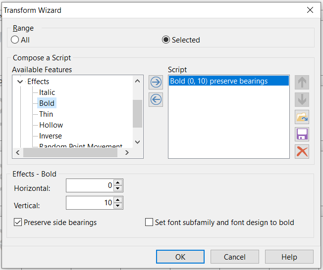

## 猫啃网扛重族 | Maoken Heavy Labourer
# 封装字体／Building the font

## 参考步骤 Sample steps

参考步骤如下：  
Sample steps are as follow:

0. 加粗字体  
Boldening the font
1. 制作映射表  
Creating the Mapping Table
2. 将字体从字符名称换成 CID 编号名称  
Name-keyed to CID-keyed Conversion
3. 微调 CID 字体源文件  
Hinting the CIDFont Resource
4. 封装 CID OpenType 字体  
Building the CID-keyed OpenType Font
5. （特别）将 OTF 转为 TTF <- 猫啃反馈 OTF 版在 Adobe Photoshop CC 2020 无法使用，因此需要转换成 TTF  
(Extra) Convert OTF to TTF <- Maoken has given feedback that OTF version will crash in Adobe Photoshop CC 2020, thus convert to TTF

工具/Tools：[AFDKO](https://github.com/adobe-type-tools/afdko)

以下只提供大致讲解，详细操作请见[命令文件](./FULL/build_command.txt)。  
The following is a rough outline, see [build commands](./FULL/build_command.txt) for detailed command.

## 加粗字体 Boldening the font

因为思源宋体横笔略细，因此先使用 FontForge 整体加粗，通过 Element > Style > Change Weight...(Ctrl+Shift+!) 设置如下：  
As the horizontal stems of Source Han Sans are slightly too thin, thus the font is enbolden with FontForge with the following settings in Element > Style > Change Weight...(Ctrl+Shift+!) :  

## 获得文件 Getting files

请到[思源宋体仓库](https://github.com/adobe-fonts/source-han-serif)下的主目录及 Heavy 文件夹下载需要的文件。  
Please visit [the repository of Source Han Serif](https://github.com/adobe-fonts/source-han-serif) and download required files from the main repo and Heavy folder.

## 脚本解析 Decoding scripts

请参考[黑体版](../build_final_otf_sans)解说。  
Please refer to the decription in the [Gothic version](../build_final_otf_sans).

## 文件解析 Decoding files

* `raw.txt` - 字体文件的映射及字形顺序编码（给 CID 使用）。  
  (CID) Mapping and glyph ID for font file.
* `map.txt` - 字体文件的字形对 CID 编码映射。  
  Mapping of glyphs to CID number in font file.
* `font.pfa` - 向量外框文件。  
  Vector outline file.
* `cidfontinfo` - 字体文件资料。  
  Info for font file.
* `cidfont.raw` - 未进行字体微调（hinting）的字体文件。  
  Unhinted font file.
* `cidfont.ps` - 已进行字体微调的字体文件。  
  Hinted font file.

## 参考 Reference

*Dr. Ken Lunde - [Leveraging AFDKO Tools to Convert Name-keyed OpenType Fonts to CID-keyed (Part 1)](https://ccjktype.fonts.adobe.com/2011/12/leveraging-afdko-part-1.html) [(Part 2)](https://ccjktype.fonts.adobe.com/2012/01/leveraging-afdko-part-2.html) [(Part 3)](https://ccjktype.fonts.adobe.com/2012/01/leveraging-afdko-part-3.html) (英文/English)