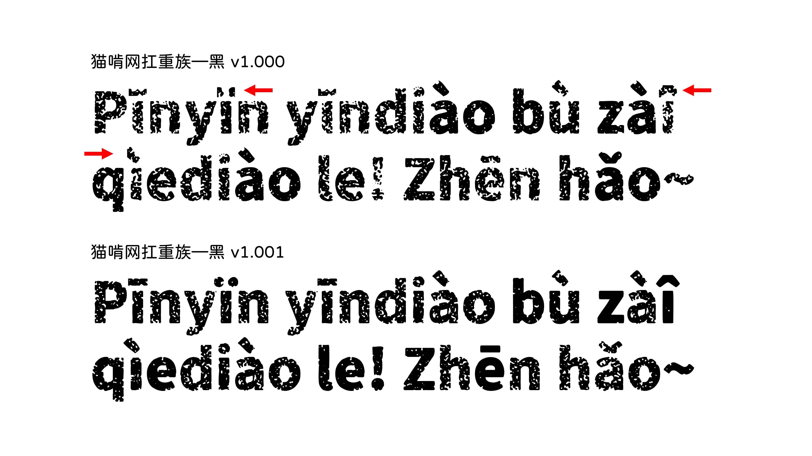
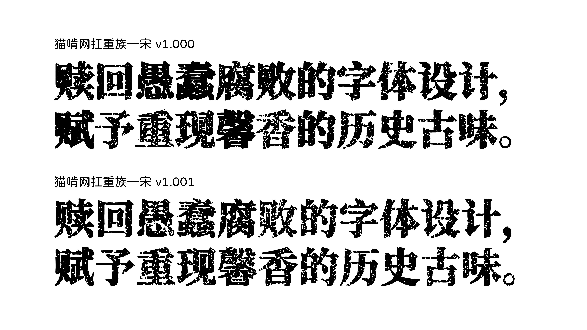

## 猫啃网扛重族 | Maoken Heavy Labourer

# 更新日志 Update record

## 猫啃网扛重族 Maoken Heavy Labourer v1.001

发布于：2021 年 7 月 20 日  
Released on: 20 July 2021

### 黑 Gothic v1.001

重修代码，避免砍掉负边界的字形（主要针对带标字符，如 `îïì`）。  
Refactor code to prevent cutting negative side bearing glyphs (mainly to fix letters with diacritics, such as `îïì`).

### 宋 Ming v1.001

将原字体从整体加粗 10 px 修改成横向笔画加粗 10 px 以避免模糊汉字。  
Changed the base font from emboldening the whole font by 10 px, to thicking only horizontal strokes by 10 px to prevent blurring Chinese characters.

## 猫啃网扛重族—宋 Maoken Heavy Labourer - Ming v1.000

发布于：2021 年 7 月 11 日  
Released on: 11 July 2021

猫啃网发布页面请见 https://www.maoken.com/freefonts/11876.html。  
Released on Maoken.com on https://www.maoken.com/freefonts/11876.html.

## 猫啃网扛重族—黑 Maoken Heavy Labourer - Gothic v1.000

发布于：2021 年 5 月 24 日  
Released on: 24 May 2021

猫啃网发布页面请见 http://www.maoken.com/freefonts/11067.html。  
Released on Maoken.com on http://www.maoken.com/freefonts/11067.html.